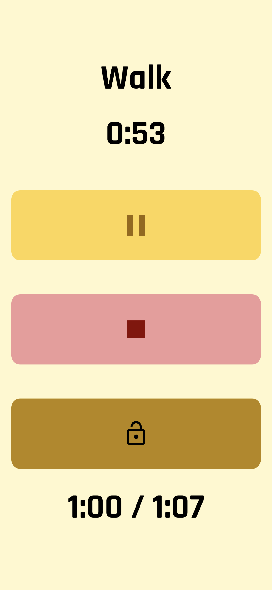

# CardioSplit Timer

**CardioSplit Timer** is a customizable interval timer designed for running/walking routines. Built in React Native with Expo, it features audio and haptic feedback, visual cues, and lock protection to prevent accidental taps.

---

## Features

* **Custom Intervals:** Set total workout time, run time, and walk time.
* **Pre-Start Countdown:** "Ready / Set / Go" phase with sound cues.
* **Visual Timer:** Displays current interval type and countdown.
* **Elapsed Time Display:** Tracks total time in-session.
* **Audio Feedback:** Plays beeps for countdowns and switches.
* **Vibration Cues:** Different buzz patterns for Run and Walk.
* **Lock Protection:** Pause/Stop buttons are hidden unless unlocked with a long-press.
* **Responsive Design:** Modern UI with color-coded states and shadows.

---

## Installation

```bash
git clone https://github.com/yourusername/cardio-split-timer.git
cd cardio-split-timer
npm install
expo start
```

> Make sure to install these dependencies:

```bash
expo install expo-av expo-keep-awake expo-font
```

---

## Configuration

* **Audio Files:** Beeps for run/walk countdowns and switches are stored in `/assets`.
* **Fonts:** Uses [Rajdhani](https://fonts.google.com/specimen/Rajdhani) for a bold timer look.
* **Lock Button:** Long-press for 1 second to toggle visibility of Pause/Stop buttons.

---

## Build for Android

For personal use:

```bash
eas build --platform android --profile preview
```

> To install on device, build an `.apk` instead of `.aab`

---

## Planned Features

* Workout history saved to local storage (SQLite)
* Sync to Google Fit
* Visual animations for transitions and countdowns
* Optional music player integration

---

## License

MIT License

---

## Screenshots

### Home Screen


### Run Screen


### Walk Screen
